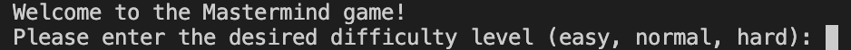
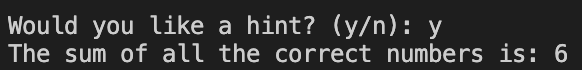
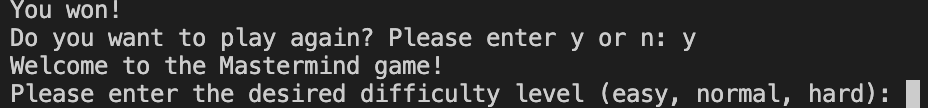
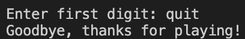

# Mastermind Game

### **Description**

The mastermind game is played against a computer where the player tries to guess the randomly generated number combination. At the end of each attempt, the player recieves feedback on the number of numbers guessed correctly and the number of correct locations guessed corrrectly. The player has 10 tries to guess the correct combination in order before the game is over. Depending on the selected dificulty, the computer will randomly generate a pattern of three to five numbers from a pool of 8 numbers between 0 and 7.

The requests module will allow us to send HTTP requests to return the randomly generated numbers using the API url and parameters. 
The sys module is used to to exit the python interpreter at anytime during the game if the user wishes to exit or stop the game.
The json module is used for json.loads and json.dumps to serialize and deserialize data. This converts Python to JSON and JSON back to Python, which is needed for the HTTP request. The API key is imported from the congif.py file which is also listed in the .gitignore file to keep the API key private.

The `valid_inputs()` function is used to account for any value errors that would occur when the user inputs guesses with the try and except block. This function also ensures that the user enters only one digit for the input between 0 and 7.

The `random_generator()` function is used to generate and return the list of random numbers using the random.org API along with the `numbers` variable. The `numbers` variable is set to the `select_difficult()` function for the number of digits the user wants to guess based on the difficulty. `numbers` is plugged into the `n` parameter in `data`. The data in the `data` variable is serialized into json data with json.dumps and the HTTP request is made in the `response` variable. `rand_nums_dict` is the dictionary that the json data is deserialized into. `rand_nums_dict['result']['random']['data']` accesses the list of randomly generated numbers within the nested dictionaries and is set to the variable `rand_nums_list`. 

The `check_guesses()` function creates a list with a number of `None` values equal to `numbers`. Within the `while n < numbers:` loop the user is prompted to input a guess, which then replaces the `None` value in `guess_list` at index `n`. `order_hash` is a dictionary that has a key-value pair between n and the corresponding guess. This is used in the input string concatenation to print out the current digit being guessed. The `validate_input` function is used to ensure the user inputs a valid input. This while loop continues until `n` is no longer less than `numbers` and all the `None` values in `guess_list` are replaced with the guesses from the user's input. 

The `check_victory` function compares the list of current guesses to the list of randomly generated numbers to see if the lists are equal. If they are equal, then `locations` would equal `numbers` and the user wins the game. The user is prompted to play the game again with the `retry_game()` function and `master_mind()` function in the following line if the user decides to play again.

The `master_mind()` function is the main function for the mastermind game. The code contained within the while loop  `while location < numbers:` will continue to run until the user wins or loses the game. If the `location` counter is equal to `numbers` variable, then the user guessed all of the correct numbers at the correct locations.  Once the `tries` counter reaches 10 after 10 attempts it will be game over and the code will exit. `guess_list_dictionary` contains a dictionary of the list of the user's previous guesses, which will have a key value pairing with the associated number in the `tries_hash` dictionary. If the list of `current_guess_list` equals the list of randomly generated numbers `rand_nums_list`, the user wins and will be prompted to play the game again. To compare the user's guesses with the randomly generated numbers, a copy of `rand_nums_list` is created as `copy_randnums_list`. The code within the while loop `while n < numbers:` will compare the the user's guesses at each index to the values of `copy_randnums_list`. If a guess matches with a value in `copy_randnums_list`, the correct counter will increment by 1 and the value matching the guess will be popped off the `copy_randnums_list` so the correct counter will not double count on the following guesses. If one of the guesses in `current_guess_list` matches a number in `rand_nums_list` at the same index, the location counter will increment by one. The while loop ends once `n` is no longer less than `numbers` because all `n` of the guesses have been compared to the number of digits in `rand_nums_list`. The following print statements inform the user of the number of correct guesses, correct locations, number of tries left, and previous guesses. The `correct` and `location` counters are set back to 0 and the `while location < numbers:` loop continues.

## How to run

The Mastermind game can be run in the terminal or command line in the mastermind.py file.\
Enter `python mastermind.py` in the terminal.

### Requirements:
- The requests module needs to be imported, but may need to be installed first through pip install requests. 
- sys module
- json module
- constants module from the constants file
   - This allows us to use the global variables 
- API key from random.org
   1. Create an account on random.org and create an API key.
   2. Create a config.py file.
   3. Create an `api_key` variable, copy paste your API key from random.org , and set it equal to `api_key`.
   4. Create a .gitignore file and type config.py on the first line.
      - This keeps your API key private when you push to github.
   5. Import `api_key` from config.py to main.py by including `from config import api_key` at the top with the imports.
      - This will allow you to use your API key while keeping it protected.


## Extensions:

### Selecting Difficulty
The `select_difficulty()` function is used to allow the user to pick a difficulty setting which determines the number of digits that needs to be guessed with easy being 3 digits, normal being 4, and hard being 5. The difficulty is determined by the user's input and the function will run again if the user types anything other than the stated difficulty settings due to the while loop `while digits == 0:`. The function returns the number of digits, which will be assigned to the `numbers` variable in the `random_generator()` function and will be assigned again in the `master_mind()` function.



### Option to receive a hint
The option for the user to access a hint is offered after the 9th try with the `ask_hint()`function. The user is told to input either "y" or "n" with "y" returning a string revealing the sum of the values in `rand_nums_list`. Any input other than "y" or "n" from the user will prompt the user again with `ask_hint()`. The following is executed once the `tries` counter reaches 9 with the following code:
```
hint = input("Would you like a hint? (y/n): ")
if hint == "y":
    print("The sum of all the correct numbers is: " +
            str(sum(lst)))
else:
    print("You got this!")
 ```       
Within `master_mind()`:
 ```
if tries == 9:
    ask_hint(rand_nums_list)
```                



### Option to retry
There is an option for the user to retry or play again at the end of the game with the `retry_game()` function. The user is prompted with a string asking to play again with an input of "y" rerunning the `master_mind()` function to play again or an input of "n" to exit the python interpreter and printing "Thank you for playing". The following is executed once the game is over: 
```
def retry_game():
    retry = input("Do you want to play again? Please enter y or n: ")
    if retry == "y":
        return True
```
Within `master_mind()` when the player wins:
```
if current_guess_list == rand_nums_list:
    print("You won!")
    if retry_game():
        master_mind()
    else:
        sys.exit("Thank you for playing!")
```
Within `master_mind()` when the player loses:
```
if tries == 10:
    print("Game over! Here is the correct answer: " +
            str(rand_nums_list))
    if retry_game():
        master_mind()
    else:
        sys.exit("Thank you for playing!")
```



### Option to quit 

An option to quit and exit the game was implemented through the imported sys module with `sys.exit`, allowing the user to type "quit" at any guess to exit the game. This will print the string "Goodbye, thanks for playing!" and exit the python interpreter.



### **Testing**


### Requirements:
- import unittest in test_main.py
- import the main module in test_main.py

Run the following in the terminal to run the unit test for the `valid_input` function: `python -m unittest test_main.py`

### **Linting**
- flake8
- black